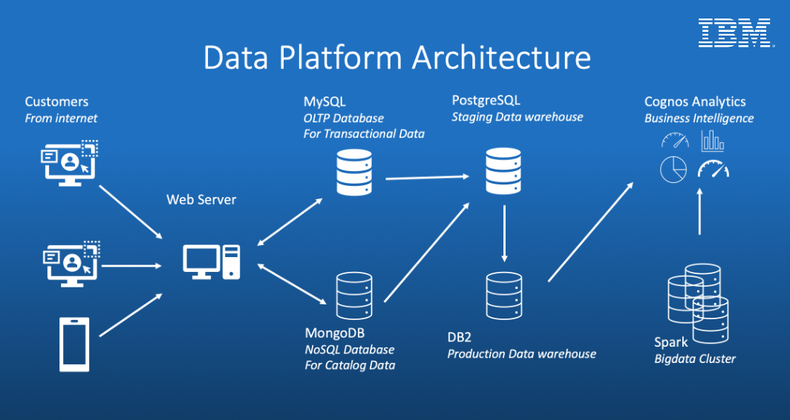

# SoftCart Data Engineering Project
## Objectives
- Demonstrate proficiency in skills required for an entry-level data engineering role.
- Design and implement various concepts and components in the data engineering lifecycle.
- Showcase working knowledge with relational databases, NoSQL data stores, big data engines, data warehouses, and data pipelines.
- Apply skills in Linux shell scripting, SQL, and Python programming languages to Data Engineering problems.



## Project Overview
SoftCart's online presence is primarily through its website, which customers access using a variety of devices like laptops, mobiles, and tablets. This project involves designing and implementing various data repositories and pipelines to support SoftCart's operations and analytics.

## Data Sources and Repositories
- MongoDB: Stores catalog data of the products.
- MySQL: Manages transactional data like inventory and sales.
- PostgreSQL: Used for the staging data warehouse.
- Snowflake: Serves as the production data warehouse on the cloud.
- Hadoop: Used as the big data platform for analytics.
- Apache Spark: Utilized for big data analysis on the Hadoop cluster.

## Tools and Software
- ETL Pipelines: Managed using Apache Airflow.
- BI Dashboards: Created with IBM Cognos Analytics.

## Assignment Breakdown
### 1. MySQL Online Transactional Processing Database
- Task: Design the database schema for storing sales data, create an index on the timestamp column, and write a bash script to export sales data into a SQL file.
- Tools: MySQL, Bash scripting.
### 2. MongoDB NoSQL Catalog Database
- Task: Create the catalog database and import electronics products from catalog.json into a collection named electronics. Run test queries and export the collection to electronics.csv using only the _id, type, and model fields.
- Tools: MongoDB.
### 3. PostgreSQL Staging Data Warehouse
- Task: Design a data warehouse star schema using pgAdmin ERD design tool, extract sales data from MySQL and catalog data from MongoDB, and store it in the PostgreSQL staging data warehouse. Generate reports such as total sales per year per country, total sales per month per category, total sales per quarter per country, and total sales per category per country.
- Tools: PostgreSQL, pgAdmin.
### 4. Snowflake Production Data Warehouse
- Task: Create a Snowflake instance using the adjusted schema design, load sample datasets into the tables, write aggregation queries, and create a Materialized Query Table for future reports.
- Tools: Snowflake.
### 5. Python Scripts & Automation
- Task: Automate the synchronization process between the staging data warehouse and production data warehouse by regularly updating the DB2 instance with new records from MySQL.
- Tools: Python.
### 6. Apache Airflow ETL & Data Pipelines
- Task: Write an Airflow DAG pipeline that analyzes the web server log files (accesslog.txt), extracts the required lines and fields, transforms and loads the data to an existing file.
- Tools: Apache Airflow.
### 7. Apache Spark Big Data Analytics
- Task: Run analytic queries on the search terms data using PySpark and JupyterLab. Use a pretrained sales forecasting model to predict the sales for 2023.
- Tools: Apache Spark, PySpark, JupyterLab.

## Project Structure
```graphql
├── mysql/
│   ├── schema.sql
│   ├── export_sales.sh
│   └── sample_sales_data.sql
├── mongodb/
│   ├── import_catalog.py
│   ├── catalog.json
│   └── export_electronics.py
├── postgresql/
│   ├── erd_design.pgerd
│   ├── staging_schema.sql
│   └── load_staging_data.py
├── Snowflake/
│   ├── production_schema.sql
│   ├── load_production_data.py
│   └── aggregation_queries.sql
├── python_scripts/
│   └── sync_databases.py
├── airflow/
│   └── dag_pipeline.py
├── spark/
│   ├── search_terms_analysis.ipynb
│   └── sales_forecasting_model.pkl
└── README.md
```
